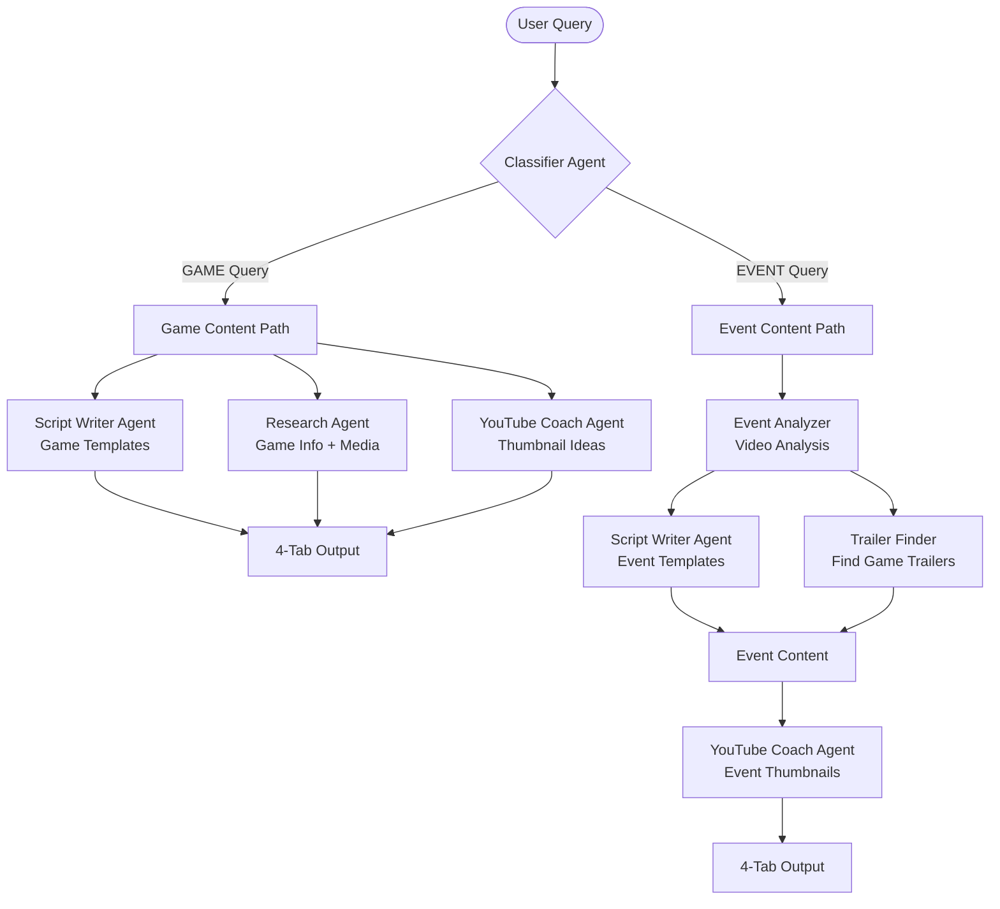

# 🎮 GameCraft AI

**AI-powered YouTube video summary and script generator for gaming content creators**

A streamlined 3-agent AI system that helps YouTube gaming content creators produce professional video content. Generate production-ready scripts, research data, video footage links, and viral thumbnail strategies from simple natural language queries in English or French.

## ✨ Features

### **Core 3-Agent System (User-Facing)**
1. **🎬 Script Writer Agent**: Creates production-ready video scripts with timestamps for games/events
2. **🔍 Research Agent**: Finds official YouTube trailer links and gathers comprehensive game/event data
3. **🎨 YouTube Coach Agent**: Generates 3 viral thumbnail prompts for image generation services

*Note: Classifier Agent handles routing but is not part of the core user-facing workflow*

### **Key Capabilities**
- **🎯 Dual Content Types**: Game reviews/previews + Event coverage summaries
- **🌍 Bilingual Support**: English and French with automatic language detection
- **🎪 User-Selectable AI Models**: 6 options (GPT-4o, Claude-3.5-Sonnet, etc.)
- **📋 4-Tab Output**: Script, Research Data, YouTube Links, Thumbnail Ideas
- **⏱️ Target Duration**: 5-20 minutes with proper script structuring
- **⚡ Fast Processing**: <60 seconds for game content, <5 minutes for events
- **🎨 Modern UI**: Clean Gradio interface with real-time progress

## 🏗️ Architecture

### **3-Agent System (Per PRD)**
Based on the latest PRD, the system uses 3 core user-facing agents:

**Core Agents:**
- **🎬 Script Writer Agent**: Multi-format script generation (review, preview, complete guide, event summary)
- **🔍 Research Agent**: Combined game info + media discovery + review aggregation + YouTube trailer search
- **🎨 YouTube Coach Agent**: Viral thumbnail strategy + AI-ready image generation prompts

**Supporting Infrastructure:**
- **🤖 Classifier Agent**: Query routing and parameter extraction (internal)
- **📊 Event Analysis**: Video processing for event content (internal)
- **🎯 Trailer Finding**: Media discovery for announced games (internal)

**Tech Stack:**
- **LangGraph**: Multi-agent orchestration
- **Gradio**: Web UI
- **Pydantic**: Data validation and modeling
- **httpx**: HTTP client for external APIs

## 🚀 Quick Start

### 1. Project Setup

```bash
# Clone and setup
git clone <your-repo>
cd gamecraft-ai

# Install dependencies with uv
uv sync
```

### 2. Environment Configuration

```bash
# Copy environment template
cp .env.example .env

# Edit .env with your API keys:
# - OPENAI_API_KEY (required)
# - YOUTUBE_API_KEY (required)
# - IGDB_CLIENT_ID & IGDB_ACCESS_TOKEN (required)
# - ANTHROPIC_API_KEY (optional)
```

### 3. Run the Application

**Method 1: Direct uv command (Recommended)**
```bash
# Default start (port 8000)
uv run python -m src.gamecraft_ai.main

# Custom port and debug mode
uv run python -m src.gamecraft_ai.main --port 7860 --debug
```

**Method 2: Convenient launcher**
```bash
# Simple start
./gamecraft

# With options
./gamecraft --port 7860 --debug
```

**Method 3: Legacy python script**
```bash
python run.py  # Uses uv internally
```

**Method 4: Using Make**
```bash
make run  # Uses uv internally
```

### 4. Test the System

Open your browser to `http://localhost:8000` and try:

**Game Review Examples:**
```
Make a 10-minute review video about Baldur's Gate 3
Create a 15-minute video about Starfield
Make a preview video about GTA 6
Create everything you need to know about Hollow Knight Silksong
```

**Event Summary Examples:**
```
Make a 15-min summary of Xbox Showcase [URL]
Make a 20-minute summary of E3 2025 showcase [URL]
```

**French Examples:**
```
Crée une vidéo de 20 minutes sur Hogwarts Legacy
Fais une critique de 10 minutes de Spider-Man 2
Fais un résumé de 15 minutes du Nintendo Direct [URL]
```

## 📁 Project Structure

```
src/gamecraft_ai/
├── models/           # Pydantic data models
│   ├── query.py     # Input validation
│   ├── content.py   # Game/event data structures
│   └── output.py    # Script output format
├── agents/          # LangGraph agent nodes
│   ├── classifier.py    # Query classification
│   ├── game_researcher.py  # Combined game research
│   ├── event_analyzer.py   # Event video analysis
│   └── script_writer.py    # Script generation
├── services/        # External API clients
│   ├── youtube.py   # YouTube Data API
│   ├── igdb.py     # Game database
│   └── llm.py      # OpenAI/Anthropic
├── graph/           # LangGraph workflow
│   ├── state.py    # State management
│   ├── nodes.py    # Node implementations
│   └── workflow.py # Workflow orchestration
├── ui/              # Gradio interface
│   ├── app.py      # UI components
│   └── handlers.py # Event handling
├── utils/           # Shared utilities
│   ├── cache.py    # Caching (memory/Redis)
│   ├── helpers.py  # Common functions
│   └── logging.py  # Logging setup
├── config.py        # Settings management
└── main.py         # Application entry point
```

## 🔧 Configuration

**Key Environment Variables:**

```bash
# Required API Keys
OPENAI_API_KEY=sk-...           # OpenAI for LLM processing
YOUTUBE_API_KEY=AIza...         # YouTube Data API v3
IGDB_CLIENT_ID=...              # IGDB game database
IGDB_ACCESS_TOKEN=...           # IGDB access token

# Optional
ANTHROPIC_API_KEY=sk-ant-...    # Alternative LLM
REDIS_URL=redis://localhost:6379/0  # Cache (uses memory if not set)

# App Settings
DEBUG=false
HOST=0.0.0.0
PORT=7860
LOG_LEVEL=INFO
```

## 🎯 Usage Examples

### Query Types

**Game Review/Content:**
- "Make a 10-minute review video about [Game Name]"
- "Create a 15-minute preview of [Game Name]"
- "Everything you need to know about [Game Name]"

**Event Summaries:**
- "Make a 20-minute summary of [Event Name] [YouTube URL]"
- "Summarize the Nintendo Direct [YouTube URL]"

**French Support:**
- "Fais une critique de 15 minutes de [Nom du Jeu]"
- "Crée un résumé de 10 minutes du [Event] [URL]"

### Generated Output (4-Tab Structure)

Each query produces comprehensive content for video production:

**📜 Script Tab**
- Production-ready timestamped scripts
- Multiple formats: review, preview, summary, complete guide
- Bilingual support with proper gaming terminology

**🔍 Research Data Tab**
- Game information (developer, publisher, release date, platforms)
- Critical reception and review scores
- Key features and talking points

**🎥 YouTube Links Tab**
- Official trailers (announcement, gameplay, launch)
- Review videos from major outlets
- Developer interviews and behind-the-scenes content

**🖼️ Thumbnail Ideas Tab**
- 3 AI-ready image generation prompts
- Viral thumbnail strategies and design tips
- Color schemes and mobile optimization guidelines

## 🛠️ Development

### Dependencies Management

```bash
# Install all dependencies (including dev)
uv sync

# Install production only
uv sync --no-dev

# Add new dependencies
uv add package-name

# Add development dependencies
uv add --dev package-name

# Update dependencies
uv sync --upgrade
```

### Code Quality

```bash
make lint      # Run ruff linting
make format    # Auto-format code
make type-check # Run mypy
make test      # Run test suite
```

### Testing

```bash
# Run all tests
make test

# Run specific test
uv run pytest tests/test_classifier.py -v

# Test with coverage
uv run pytest --cov=src --cov-report=html
```

## 🔄 LangGraph Workflow

**3-Agent Processing Pipeline:**



**Key Features:**
- **Conditional Routing**: Game vs Event content paths
- **Parallel Processing**: Game path agents run simultaneously for speed
- **Sequential + Parallel**: Event path optimizes for accuracy then speed
- **Unified Output**: Both paths produce the same 4-tab structure
- **Error Handling**: Graceful fallbacks at each node
- **Caching**: Redis/memory caching for performance

## 🚨 Troubleshooting

**Common Issues:**

1. **Missing API Keys**
   ```bash
   # Check environment
   python -c "from src.gamecraft_ai.config import settings; print(settings.openai_api_key)"
   ```

2. **Import Errors**
   ```bash
   # Reinstall dependencies
   make clean && make dev
   ```

3. **Port Already in Use**
   ```bash
   python run.py --port 8080
   ```

4. **Memory Issues**
   ```bash
   # Enable Redis caching
   export REDIS_URL=redis://localhost:6379/0
   ```

## 📈 Performance

**Target Metrics (3-Agent System):**
- **Query classification**: <500ms
- **Script Writer Agent**: <30 seconds
- **Research Agent**: <20 seconds (info gathering + YouTube search)
- **YouTube Coach Agent**: <10 seconds (thumbnail suggestions)
- **Total processing**: <60 seconds for game content, <5 minutes for events
- **Information accuracy**: >95% for game details
- **Trailer match rate**: >90% for requested games
- **User script acceptance**: >80% (minimal edits needed)
- **Concurrent users**: 10

## 🤝 Contributing

1. Follow the modular structure
2. Use Pydantic for all data models
3. Add type hints everywhere
4. Write tests for new features
5. Run `make lint` before committing

## 📄 License

MIT License - see LICENSE file for details.

---

**Built with ❤️ for gaming content creators**
