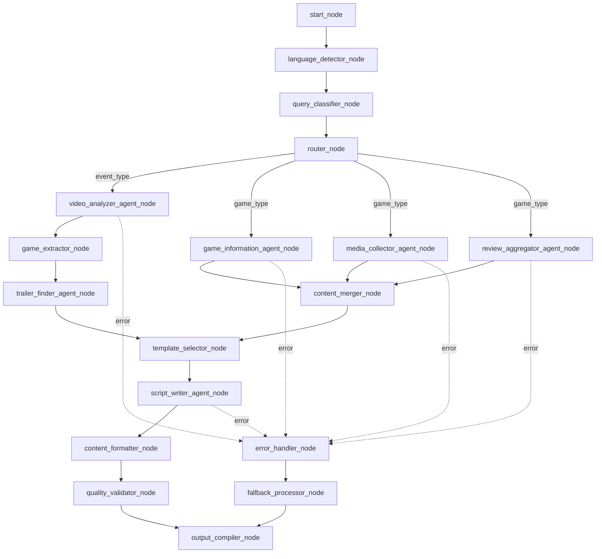
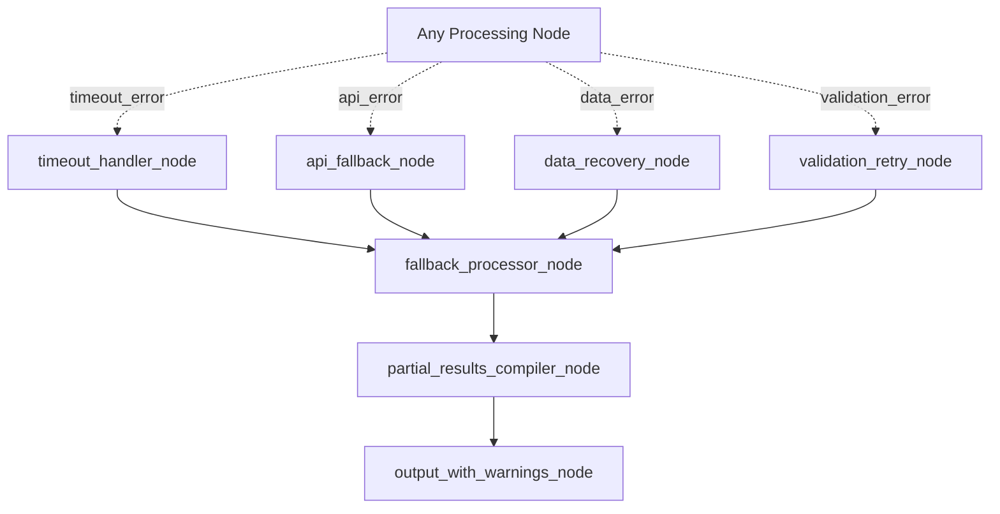
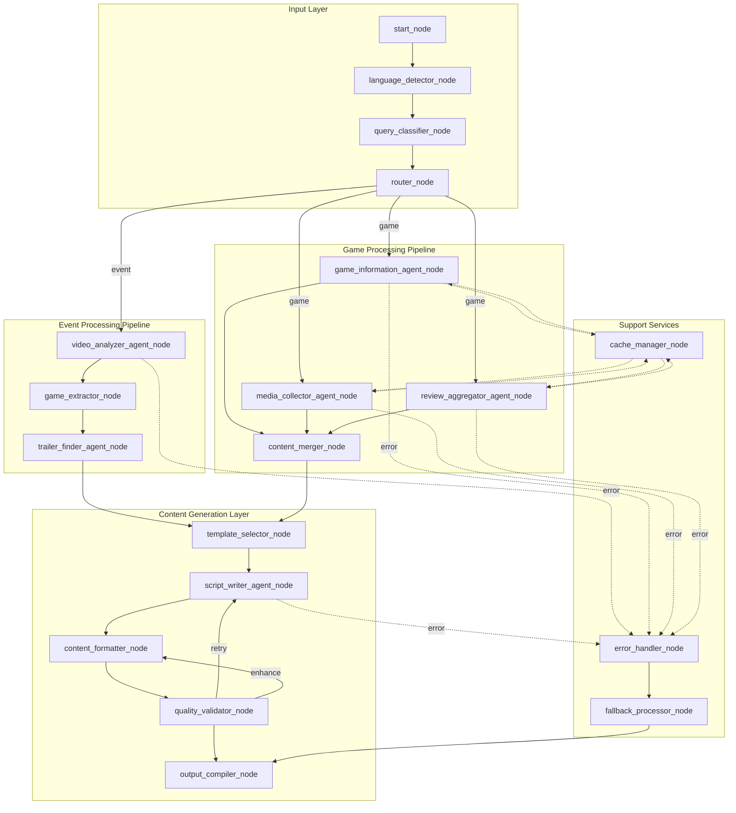
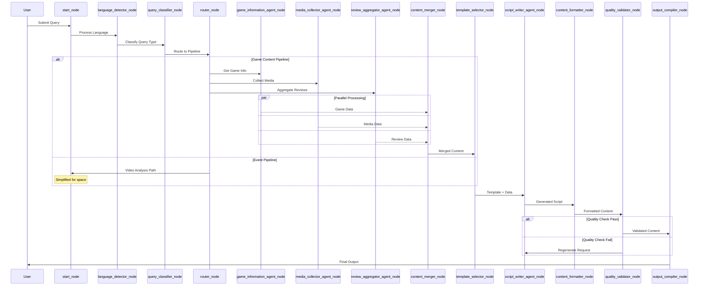

# GameCraft AI - LangGraph Architecture Specification

**Version:** 1.0
**Date:** August 2025
**Status:** Technical Specification

---

## Executive Summary

This document defines the complete LangGraph architecture for the GameCraft AI dual-mode system, mapping out all nodes, edges, state management, and flow relationships for both Event Coverage and Game Content generation modes.

The architecture implements a sophisticated agent orchestration system that dynamically routes queries, processes content in parallel where possible, and maintains comprehensive state management throughout the execution pipeline.

## High-Level Architecture Overview

The LangGraph implementation consists of four primary layers:

1. **Input Processing Layer**: Query classification, language detection, and routing
2. **Agent Execution Layer**: Specialized agents for different content types and tasks
3. **Content Generation Layer**: Script writing, formatting, and output compilation
4. **State Management Layer**: Cross-agent data flow and persistence

## Complete Node Structure

### 1. Entry Points and Routing Logic

#### `start_node`
**Purpose**: Entry point for all user queries
**Inputs**: Raw user query string
**Outputs**: Initial state with query metadata
**State Updates**:
```python
{
    "query_text": str,
    "timestamp": datetime,
    "session_id": str,
    "processing_status": "started"
}
```

#### `language_detector_node`
**Purpose**: Detect query language (EN/FR) and extract language-specific terminology
**Inputs**: Query text from state
**Outputs**: Language detection results
**State Updates**:
```python
{
    "detected_language": str,  # "en" or "fr"
    "confidence_score": float,
    "localized_terms": dict
}
```

#### `query_classifier_node`
**Purpose**: Classify query type (event vs. game) and extract parameters
**Inputs**: Query text and language from state
**Outputs**: Classification results and extracted parameters
**State Updates**:
```python
{
    "query_type": str,  # "event" or "game"
    "classification_confidence": float,
    "extracted_params": {
        "target_duration": int,
        "content_format": str,
        "event_url": str,  # if event type
        "game_name": str,  # if game type
        "additional_context": str
    }
}
```

#### `router_node`
**Purpose**: Route to appropriate processing pipeline based on classification
**Inputs**: Classification results from state
**Outputs**: Routing decision
**State Updates**:
```python
{
    "selected_pipeline": str,  # "event_pipeline" or "game_pipeline"
    "routing_timestamp": datetime
}
```

### 2. Event Processing Pipeline Nodes

#### `video_analyzer_agent_node`
**Purpose**: Extract game announcements and key moments from event videos
**Inputs**: Event URL and metadata from state
**Outputs**: Structured event analysis
**State Updates**:
```python
{
    "event_analysis": {
        "video_metadata": {
            "duration": int,
            "title": str,
            "description": str,
            "upload_date": datetime
        },
        "transcript_segments": List[dict],
        "announced_games": List[dict],
        "key_timestamps": List[dict],
        "speaker_segments": List[dict]
    }
}
```

#### `game_extractor_node`
**Purpose**: Process announced games list and prepare for trailer search
**Inputs**: Event analysis from state
**Outputs**: Cleaned and validated game list
**State Updates**:
```python
{
    "extracted_games": List[{
        "name": str,
        "mentioned_timestamp": float,
        "context": str,
        "confidence": float,
        "platform_hints": List[str]
    }]
}
```

#### `trailer_finder_agent_node`
**Purpose**: Find official trailers for all announced games
**Inputs**: Extracted games list from state
**Outputs**: Trailer URLs and metadata
**State Updates**:
```python
{
    "found_trailers": List[{
        "game_name": str,
        "trailer_url": str,
        "trailer_title": str,
        "duration": int,
        "upload_date": datetime,
        "channel": str,
        "trailer_type": str  # "announcement", "gameplay", "cinematic"
    }]
}
```

### 3. Game Content Pipeline Nodes

#### `game_information_agent_node`
**Purpose**: Gather comprehensive game information from multiple sources
**Inputs**: Game name from state
**Outputs**: Complete game information dataset
**State Updates**:
```python
{
    "game_information": {
        "basic_info": {
            "name": str,
            "developer": str,
            "publisher": str,
            "release_date": datetime,
            "platforms": List[str],
            "genre": List[str],
            "price": dict,  # by platform
            "age_rating": str
        },
        "detailed_info": {
            "description": str,
            "key_features": List[str],
            "gameplay_mechanics": List[str],
            "story_synopsis": str,
            "technical_specs": dict,
            "dlc_info": List[dict],
            "update_history": List[dict]
        },
        "sources": List[str]
    }
}
```

#### `media_collector_agent_node`
**Purpose**: Discover and catalog all related media content
**Inputs**: Game name from state
**Outputs**: Comprehensive media asset collection
**State Updates**:
```python
{
    "media_assets": {
        "trailers": List[{
            "type": str,  # "announcement", "gameplay", "launch", "dlc"
            "url": str,
            "title": str,
            "duration": int,
            "upload_date": datetime,
            "channel": str,
            "view_count": int,
            "quality": str
        }],
        "gameplay_videos": List[dict],
        "developer_content": List[dict],
        "review_videos": List[dict],
        "behind_scenes": List[dict]
    }
}
```

#### `review_aggregator_agent_node`
**Purpose**: Collect and analyze review scores and critical reception
**Inputs**: Game name from state
**Outputs**: Aggregated review data and sentiment analysis
**State Updates**:
```python
{
    "review_data": {
        "professional_scores": {
            "metacritic": dict,  # by platform
            "opencritic": dict,
            "ign": dict,
            "gamespot": dict,
            "polygon": dict,
            "other_outlets": List[dict]
        },
        "user_scores": {
            "steam": dict,
            "metacritic_user": dict,
            "user_reviews_summary": dict
        },
        "sentiment_analysis": {
            "positive_themes": List[str],
            "negative_themes": List[str],
            "neutral_points": List[str],
            "controversy_areas": List[str]
        },
        "score_distribution": dict
    }
}
```

### 4. Content Generation and Output Nodes

#### `template_selector_node`
**Purpose**: Select appropriate script template based on content type and duration
**Inputs**: Query parameters and content type from state
**Outputs**: Selected template and structure
**State Updates**:
```python
{
    "selected_template": {
        "template_type": str,  # "review", "preview", "summary", "everything_guide"
        "structure": List[dict],  # timestamp segments
        "duration_target": int,
        "content_requirements": List[str]
    }
}
```

#### `script_writer_agent_node`
**Purpose**: Generate production-ready scripts using collected data
**Inputs**: All collected data and selected template from state
**Outputs**: Complete formatted script
**State Updates**:
```python
{
    "generated_script": {
        "full_script": str,
        "segments": List[{
            "timestamp": str,
            "duration": int,
            "content": str,
            "b_roll_suggestions": List[str],
            "transition_notes": str
        }],
        "metadata": {
            "word_count": int,
            "estimated_duration": int,
            "reading_pace": str,
            "difficulty_level": str
        }
    }
}
```

#### `content_formatter_node`
**Purpose**: Format output according to specified format requirements
**Inputs**: Generated script and content data from state
**Outputs**: Formatted final output
**State Updates**:
```python
{
    "formatted_output": {
        "summary_document": str,
        "script_file": str,
        "media_compilation": dict,
        "b_roll_suggestions": List[str],
        "export_formats": List[str]
    }
}
```

#### `output_compiler_node`
**Purpose**: Compile all outputs into final deliverable format
**Inputs**: All processed data from state
**Outputs**: Complete output package
**State Updates**:
```python
{
    "final_output": {
        "success": bool,
        "output_format": str,
        "file_paths": List[str],
        "summary": str,
        "processing_time": float,
        "content_stats": dict
    }
}
```

### 5. Utility and Error Handling Nodes

#### `error_handler_node`
**Purpose**: Handle processing errors and implement fallback strategies
**Inputs**: Error context from failed nodes
**Outputs**: Error resolution or fallback results
**State Updates**:
```python
{
    "error_context": {
        "error_type": str,
        "failed_node": str,
        "error_message": str,
        "fallback_applied": bool,
        "retry_count": int
    }
}
```

#### `cache_manager_node`
**Purpose**: Manage caching of frequently accessed data
**Inputs**: Data to cache or retrieve
**Outputs**: Cached or retrieved data
**State Updates**:
```python
{
    "cache_status": {
        "cache_hits": List[str],
        "cache_misses": List[str],
        "cache_updates": List[str]
    }
}
```

#### `quality_validator_node`
**Purpose**: Validate output quality and completeness
**Inputs**: Generated content from state
**Outputs**: Quality assessment and improvement suggestions
**State Updates**:
```python
{
    "quality_assessment": {
        "content_completeness": float,
        "accuracy_score": float,
        "readability_score": float,
        "improvement_suggestions": List[str],
        "quality_passed": bool
    }
}
```

## Edge Relationships and Flow Logic

### 1. Main Flow Edges



### 2. Conditional Edge Logic

#### Router Conditional Logic
```python
def route_query(state):
    query_type = state["query_type"]
    confidence = state["classification_confidence"]

    if confidence < 0.8:
        return "clarification_node"
    elif query_type == "event":
        return "event_pipeline"
    elif query_type == "game":
        return "game_pipeline"
    else:
        return "error_handler_node"
```

#### Parallel Execution Controller
```python
def control_parallel_execution(state):
    game_name = state["extracted_params"]["game_name"]

    # Start all three agents in parallel
    return {
        "game_info_path": "game_information_agent_node",
        "media_path": "media_collector_agent_node",
        "review_path": "review_aggregator_agent_node"
    }
```

#### Quality Gate Logic
```python
def quality_gate_decision(state):
    quality_score = state["quality_assessment"]["content_completeness"]
    accuracy_score = state["quality_assessment"]["accuracy_score"]

    if quality_score >= 0.85 and accuracy_score >= 0.90:
        return "output_compiler_node"
    elif quality_score >= 0.70:
        return "content_enhancer_node"
    else:
        return "regenerate_content_node"
```

### 3. Error Handling and Fallback Edges



## State Management Architecture

### Global State Schema

```python
class GameCraftState(BaseModel):
    # Session Management
    session_id: str
    user_id: Optional[str]
    timestamp: datetime
    processing_status: str

    # Input Processing
    query_text: str
    detected_language: str
    query_type: str
    extracted_params: dict

    # Event Processing State
    event_analysis: Optional[dict]
    extracted_games: Optional[List[dict]]
    found_trailers: Optional[List[dict]]

    # Game Processing State
    game_information: Optional[dict]
    media_assets: Optional[dict]
    review_data: Optional[dict]

    # Content Generation State
    selected_template: Optional[dict]
    generated_script: Optional[dict]
    formatted_output: Optional[dict]

    # Quality and Error Management
    quality_assessment: Optional[dict]
    error_context: Optional[dict]
    cache_status: Optional[dict]

    # Final Output
    final_output: Optional[dict]

    # Processing Metadata
    processing_time: float = 0.0
    nodes_executed: List[str] = []
    parallel_executions: List[str] = []
    cache_hits: int = 0
    api_calls_made: int = 0
```

### State Transformation Points

1. **Language Detection Transform**
   ```python
   def transform_language_detection(state, result):
       return {
           **state,
           "detected_language": result["language"],
           "localized_terms": result["terms"],
           "confidence_score": result["confidence"]
       }
   ```

2. **Parallel Data Merge Transform**
   ```python
   def merge_parallel_results(state):
       return {
           **state,
           "aggregated_data": {
               "game_info": state["game_information"],
               "media": state["media_assets"],
               "reviews": state["review_data"]
           }
       }
   ```

3. **Output Compilation Transform**
   ```python
   def compile_final_output(state):
       return {
           **state,
           "final_output": {
               "content": state["formatted_output"],
               "metadata": extract_metadata(state),
               "processing_stats": calculate_stats(state)
           }
       }
   ```

## Caching and Persistence Strategy

### Cache Layers

1. **L1 Cache - In-Memory (Redis)**
   - Query classification results (TTL: 1 hour)
   - Game information (TTL: 24 hours)
   - Media URLs (TTL: 12 hours)
   - Review scores (TTL: 6 hours)

2. **L2 Cache - Database (PostgreSQL)**
   - Complete game profiles (TTL: 7 days)
   - Media asset collections (TTL: 3 days)
   - Processing templates (TTL: 30 days)

3. **L3 Cache - File System**
   - Generated scripts (TTL: 24 hours)
   - Video transcripts (TTL: 7 days)
   - API response backups (TTL: 30 days)

### Cache Invalidation Strategy

```python
def cache_invalidation_logic(data_type, identifier):
    invalidation_rules = {
        "game_info": {
            "triggers": ["new_release", "price_change", "review_update"],
            "cascade": ["media_assets", "review_data"]
        },
        "media_assets": {
            "triggers": ["new_trailer", "video_removed"],
            "cascade": ["script_templates"]
        },
        "review_data": {
            "triggers": ["score_update", "new_review"],
            "cascade": []
        }
    }
    return invalidation_rules.get(data_type, {})
```

## Complete Visual Architecture

### Comprehensive Flow Diagram



### Detailed Node Interaction Map



## Performance Optimization Strategies

### Parallel Execution Patterns

1. **Game Pipeline Parallelization**
   ```python
   async def execute_game_pipeline(state):
       tasks = [
           game_information_agent_node.ainvoke(state),
           media_collector_agent_node.ainvoke(state),
           review_aggregator_agent_node.ainvoke(state)
       ]
       results = await asyncio.gather(*tasks)
       return merge_results(results)
   ```

2. **Media Discovery Parallelization**
   ```python
   async def parallel_media_search(game_name):
       searches = [
           youtube_trailer_search(game_name),
           steam_media_search(game_name),
           twitch_clips_search(game_name),
           developer_channel_search(game_name)
       ]
       return await asyncio.gather(*searches)
   ```

### Resource Management

1. **API Rate Limiting**
   ```python
   class RateLimitedExecutor:
       def __init__(self):
           self.youtube_limiter = RateLimiter(100, 60)  # 100/min
           self.steam_limiter = RateLimiter(200, 300)   # 200/5min
           self.metacritic_limiter = RateLimiter(60, 60) # 60/min
   ```

2. **Memory Management**
   ```python
   def optimize_state_size(state):
       # Remove large temporary data after processing
       if "raw_transcript" in state:
           del state["raw_transcript"]
       if "temp_media_data" in state:
           del state["temp_media_data"]
       return state
   ```

## Implementation Guidelines

### Node Implementation Template

```python
from typing import Dict, Any
from langgraph.graph import StateGraph, END

class GameCraftNode:
    def __init__(self, name: str, config: Dict[str, Any]):
        self.name = name
        self.config = config
        self.cache = CacheManager()
        self.error_handler = ErrorHandler()

    async def execute(self, state: GameCraftState) -> GameCraftState:
        try:
            # Check cache first
            cached_result = await self.cache.get(self.get_cache_key(state))
            if cached_result:
                return self.apply_cached_result(state, cached_result)

            # Execute main logic
            result = await self.process(state)

            # Cache result
            await self.cache.set(self.get_cache_key(state), result)

            # Update state
            return self.update_state(state, result)

        except Exception as e:
            return await self.error_handler.handle_error(state, e, self.name)

    async def process(self, state: GameCraftState) -> Dict[str, Any]:
        raise NotImplementedError("Subclasses must implement process method")

    def update_state(self, state: GameCraftState, result: Dict[str, Any]) -> GameCraftState:
        raise NotImplementedError("Subclasses must implement update_state method")
```

### Graph Construction

```python
def build_gamecraft_graph():
    graph = StateGraph(GameCraftState)

    # Add nodes
    graph.add_node("start", start_node)
    graph.add_node("language_detector", language_detector_node)
    graph.add_node("query_classifier", query_classifier_node)
    graph.add_node("router", router_node)

    # Event pipeline nodes
    graph.add_node("video_analyzer", video_analyzer_agent_node)
    graph.add_node("game_extractor", game_extractor_node)
    graph.add_node("trailer_finder", trailer_finder_agent_node)

    # Game pipeline nodes
    graph.add_node("game_info", game_information_agent_node)
    graph.add_node("media_collector", media_collector_agent_node)
    graph.add_node("review_aggregator", review_aggregator_agent_node)
    graph.add_node("content_merger", content_merger_node)

    # Content generation nodes
    graph.add_node("template_selector", template_selector_node)
    graph.add_node("script_writer", script_writer_agent_node)
    graph.add_node("content_formatter", content_formatter_node)
    graph.add_node("quality_validator", quality_validator_node)
    graph.add_node("output_compiler", output_compiler_node)

    # Support nodes
    graph.add_node("error_handler", error_handler_node)
    graph.add_node("cache_manager", cache_manager_node)

    # Add edges with conditions
    graph.add_edge("start", "language_detector")
    graph.add_edge("language_detector", "query_classifier")
    graph.add_edge("query_classifier", "router")

    # Conditional routing
    graph.add_conditional_edges(
        "router",
        route_query,
        {
            "event_pipeline": "video_analyzer",
            "game_pipeline": ["game_info", "media_collector", "review_aggregator"],
            "error": "error_handler"
        }
    )

    # Event pipeline edges
    graph.add_edge("video_analyzer", "game_extractor")
    graph.add_edge("game_extractor", "trailer_finder")
    graph.add_edge("trailer_finder", "template_selector")

    # Game pipeline merge
    graph.add_edge(["game_info", "media_collector", "review_aggregator"], "content_merger")
    graph.add_edge("content_merger", "template_selector")

    # Content generation pipeline
    graph.add_edge("template_selector", "script_writer")
    graph.add_edge("script_writer", "content_formatter")
    graph.add_edge("content_formatter", "quality_validator")

    # Quality validation conditional
    graph.add_conditional_edges(
        "quality_validator",
        quality_gate_decision,
        {
            "pass": "output_compiler",
            "enhance": "content_formatter",
            "regenerate": "script_writer",
            "fail": "error_handler"
        }
    )

    graph.add_edge("output_compiler", END)
    graph.add_edge("error_handler", END)

    # Set entry point
    graph.set_entry_point("start")

    return graph
```

## Error Handling and Recovery

### Error Classification

```python
class ErrorTypes:
    API_RATE_LIMIT = "api_rate_limit"
    API_UNAVAILABLE = "api_unavailable"
    DATA_NOT_FOUND = "data_not_found"
    PARSING_ERROR = "parsing_error"
    VALIDATION_ERROR = "validation_error"
    TIMEOUT_ERROR = "timeout_error"
    NETWORK_ERROR = "network_error"
    QUOTA_EXCEEDED = "quota_exceeded"
```

### Recovery Strategies

```python
def get_recovery_strategy(error_type: str, node_name: str) -> str:
    recovery_matrix = {
        "game_information_agent_node": {
            ErrorTypes.API_UNAVAILABLE: "use_cached_fallback",
            ErrorTypes.DATA_NOT_FOUND: "expand_search_terms",
            ErrorTypes.RATE_LIMIT: "queue_for_retry"
        },
        "media_collector_agent_node": {
            ErrorTypes.API_UNAVAILABLE: "use_alternative_source",
            ErrorTypes.DATA_NOT_FOUND: "search_alternative_names",
            ErrorTypes.NETWORK_ERROR: "retry_with_backoff"
        },
        "script_writer_agent_node": {
            ErrorTypes.PARSING_ERROR: "use_simpler_template",
            ErrorTypes.VALIDATION_ERROR: "regenerate_with_constraints",
            ErrorTypes.TIMEOUT_ERROR: "reduce_complexity"
        }
    }

    return recovery_matrix.get(node_name, {}).get(error_type, "graceful_degradation")
```

## Testing and Validation Strategy

### Node-Level Testing

```python
import pytest
from unittest.mock import Mock, AsyncMock

@pytest.mark.asyncio
async def test_game_information_agent_node():
    # Arrange
    mock_state = GameCraftState(
        query_text="Create a review of Baldur's Gate 3",
        extracted_params={"game_name": "Baldur's Gate 3"}
    )

    node = GameInformationAgentNode()

    # Act
    result = await node.execute(mock_state)

    # Assert
    assert result.game_information is not None
    assert result.game_information["basic_info"]["name"] == "Baldur's Gate 3"
    assert len(result.game_information["basic_info"]["platforms"]) > 0
```

### Integration Testing

```python
@pytest.mark.asyncio
async def test_complete_game_pipeline():
    # Test full game content generation pipeline
    initial_state = GameCraftState(
        query_text="Make a 10-minute review of Cyberpunk 2077"
    )

    graph = build_gamecraft_graph()
    final_state = await graph.ainvoke(initial_state)

    assert final_state.final_output is not None
    assert final_state.final_output["success"] is True
    assert "script_file" in final_state.formatted_output
```

### Performance Benchmarks

```python
@pytest.mark.benchmark
def test_processing_performance():
    """Ensure processing times meet requirements"""
    # Game content: <60 seconds total
    # Event content: <5 minutes total
    # Individual nodes: <30 seconds each
    pass
```

## Monitoring and Observability

### Key Metrics

1. **Performance Metrics**
   - Node execution time
   - End-to-end processing time
   - API response times
   - Cache hit rates

2. **Quality Metrics**
   - Content completeness scores
   - Accuracy validation results
   - User acceptance rates
   - Error recovery success rates

3. **System Metrics**
   - Concurrent execution capacity
   - Memory usage patterns
   - API quota consumption
   - Error frequency by type

### Logging Strategy

```python
import structlog

logger = structlog.get_logger()

def log_node_execution(node_name: str, state: GameCraftState, result: Any):
    logger.info(
        "node_executed",
        node=node_name,
        session_id=state.session_id,
        processing_time=get_execution_time(),
        input_size=get_state_size(state),
        output_size=get_result_size(result),
        cache_hit=was_cache_hit(),
        api_calls=count_api_calls()
    )
```

## Deployment Considerations

### Scalability Requirements

1. **Horizontal Scaling**
   - Stateless node design for easy scaling
   - Load balancing across multiple instances
   - Queue-based processing for high demand

2. **Resource Management**
   - Memory-efficient state management
   - Connection pooling for external APIs
   - Graceful degradation under load

### Configuration Management

```python
class GraphConfig:
    def __init__(self):
        self.node_configs = {
            "game_information_agent_node": {
                "timeout": 30,
                "retry_count": 3,
                "cache_ttl": 86400,  # 24 hours
                "api_sources": ["igdb", "steam", "metacritic"]
            },
            "media_collector_agent_node": {
                "timeout": 45,
                "retry_count": 2,
                "cache_ttl": 43200,  # 12 hours
                "max_results_per_type": 5
            },
            "script_writer_agent_node": {
                "timeout": 60,
                "retry_count": 1,
                "model": "claude-3",
                "temperature": 0.7
            }
        }
```

---

## Next Steps for Implementation

1. **Phase 1**: Implement core node structure and state management
2. **Phase 2**: Build event processing pipeline with existing agents
3. **Phase 3**: Develop game content pipeline with new agents
4. **Phase 4**: Implement parallel execution and caching
5. **Phase 5**: Add error handling and quality validation
6. **Phase 6**: Performance optimization and monitoring

This architecture provides a comprehensive foundation for implementing the GameCraft AI dual-mode system using LangGraph, ensuring scalability, maintainability, and robust error handling throughout the processing pipeline.
